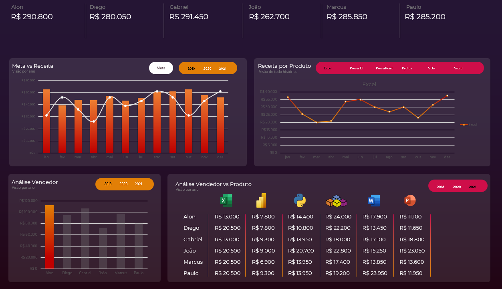

# 📊 Dashboard de Vendas — Excel

## 🎯 Objetivo do projeto

Este projeto foi desenvolvido durante a **Semana do Excel da Hashtag Treinamentos**, com o objetivo de aplicar na prática conceitos de análise e visualização de dados utilizando o Microsoft Excel.

A partir de uma base de dados de vendas, foi desenvolvido um dashboard para acompanhar receitas, metas, produtos e desempenho dos vendedores, facilitando a visualização e interpretação dos resultados.

## 🛠️ Tecnologia utilizada

- **Microsoft Excel** — utilizado como base de dados, tratamento, análise e construção do dashboard.

## 📈 Análises realizadas

O dashboard apresenta:

- Comparação entre **Meta x Receita** por ano;
- **Receita por produto** ao longo dos meses;
- Análise de vendas por **vendedor**;
- Comparação de **vendedor x produto**;
- Análise dos resultados por período;
- Indicadores de desempenho dos vendedores.

## 🖥️ Dashboard

## 📚 O que aprendi

Durante o desenvolvimento deste projeto, pude praticar:

- Organização e tratamento de dados no Excel;
- Utilização de fórmulas e recursos de análise;
- Criação de gráficos;
- Construção de indicadores;
- Desenvolvimento de dashboards;
- Análise e comparação de resultados;
- Transformação de dados em informações visuais;
- Organização e apresentação de informações para facilitar a tomada de decisões.

## 🎓 Curso

Projeto desenvolvido durante a **Semana do Excel — Hashtag Treinamentos**.

A experiência contribuiu para consolidar meus conhecimentos em Excel e análise de dados, além de fazer parte da construção do meu portfólio profissional.

## 🚀 Próximos passos

Continuar desenvolvendo meus conhecimentos na área de Dados, aprofundando meus estudos em:

- Power BI;
- SQL;
- Python;
- DAX;
- Business Intelligence;
- Análise e visualização de dados.

## 👩‍💻 Sobre mim

Sou estudante de **Análise e Desenvolvimento de Sistemas** e tenho interesse em construir minha carreira na área de **Dados e Business Intelligence**.

Atualmente, estou desenvolvendo meus conhecimentos em Excel e Power BI e utilizando projetos de cursos e acadêmicos para colocar meus aprendizados em prática e construir meu portfólio.
